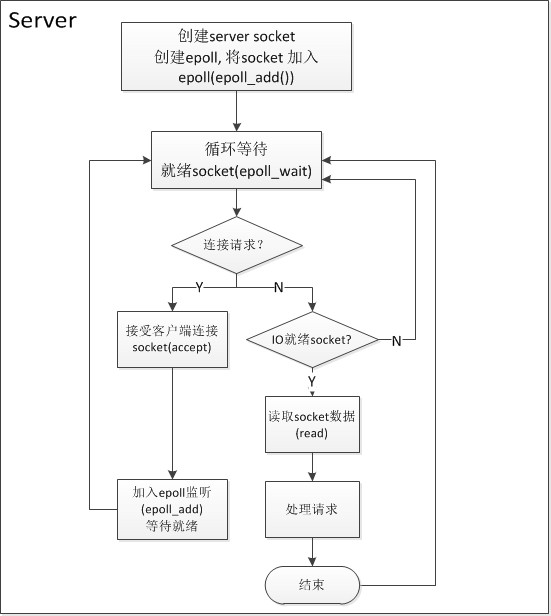
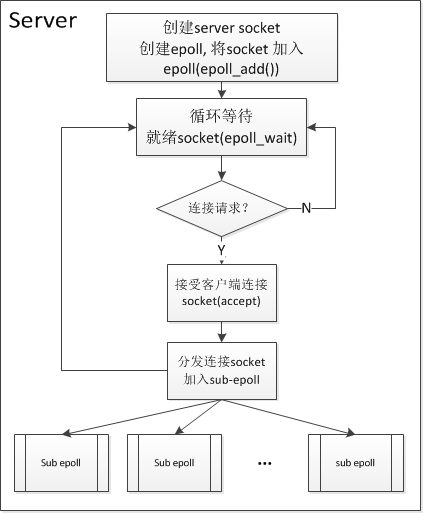
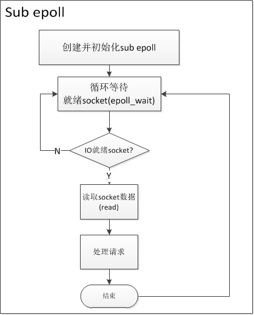

 # LGX SERVER FRAMEWORK INTRO

## Module Basic

该服务主要分为了5个模块，5个模块相互依赖，分别是

net --- 实现接受客户端请求的网络模块

thread --- 对线程常用接口进行了c++封装

util --- 常用其他工具块

work --- 客户端请求后处理模块

log --- 日志模块

## Important Class Intro

start_up: 启动模块类，用于启动各个模块。

net::net: 用于启动网络模块，网络模块各种机制的入口。

net::epoll: 对epoll常用函数进行一个封装，当然，该epoll提供储存epoll事件，还有channel类，便于查找触发的事件。

net::channel: 与epoll事件嵌套的一个基本事件类，负责epoll事件触发时实现回调功能

net::eventloop: 事件循环器，单独一个线程就创建这么个eventloop，方便各种事件实现储存化，过程化执行等。

net::http: 与channel绑定，主要用于解析http和包裹数据为http。

net::timer: 实现一个http类的计时器。

net::timer_manager: 计时器管理器，用于销毁超时的计时器，超时后，会销毁net::timer，当然就会销毁http对象了。

net::eventloop_thread: 用于创建一个eventloop线程。

 net::eventloop_threadpool: 用于管理创建出来的net::eventloop_thread。

## Epoll Intro

在了解框架之前，我们先来了解一下epoll的一些基础知识。epoll模型是目前比较优秀的IO多路复用模型，首先，epoll没有最大并发连接的限制，上限是整个系统最大可以打开的socket FD数目，一般这个数目和系统内存关系很大，1G内存的机器的最大sockef FD数目可以达到10万左右。其次，epoll最大的优点在于它只关心活跃的连接，而跟连接总数无关。因此在实际的网络环境中，epoll的效率会远高于select和poll。鉴于epoll的优点，我们的服务器采用了epoll作为IO多路复用的基本技术。常见的基于epoll的设计模式主要为单线程的事件循环，用于一些非阻塞的业务逻辑开发是很高效的，然而，在服务器开发中，涉及传输数据。转发请求的需求，耗时比较长。因此，单线程的epoll并不能满足我们的需要。下面用一个简单的例子来说明单线程模式下epoll的缺点。

由于是单线程模型，当某个客户端的请求处理时间较长时，会影响服务器接收来自其他客户端的连接请求，进而影响整个服务器的并发性能。

　　因此，单线程的epoll模型在我们的分布式服务器中并不适用。下面是我们服务器的设计方案:

　　     

　　　　　　　　　　　　    图2　　　　　　　　　　　　　　　　　　　　　　　　　　　　　  图3

　　上面这种设计模式一般称为Reactor模式，Reactor模式是处理并发I/O比较常见的一种模式，中心思想是首先将所有要处理的I/O事件添加到一个中心的多路复用器上(epoll)， 同时主线程阻塞在多路复用器上；一旦有连接到来或者是准备就绪，多路复用器将返回并将相应的I/O事件分发到对应的处理线程中。

　　我们的服务器采用了多个Reactor，也就是多线程的epoll。 Reactor被分为main reactor和sub reactors，分别对应图2 和图3。每个reactor中都有独立的epoll来作为多路复用器。其中main reactor中的epoll负责监听连接请求，一旦有连接到来，利用一定的分发策略将连接socket加入到sub reactors的epoll中。对于每个sub reactor的epoll，主要的工作就是监听连接socket，一旦某个连接socket的I/O准备就绪，则通知相应的handler来接收数据并处理请求。

　　通过使用非阻塞I/O的多路复用技术epoll，并将连接请求与连接建立的之后的逻辑分离，我们设计了基于Reactor设计模式的服务器，满足了高并发的处理数据查询请求与数据传输请求。并能够同时处理长连接与短连接。 同时，还有一些细节我们可以改进：

- Main reactor 到sub reactors的分发策略

　　目前我们采用了Round-robin的方式，这样有可能产生负载不均衡的现象。 后面我们可以使用一定的策略，将main reactor接收到的连接请求分发到相对空闲的sub

　　reactor中。保证整个系统的负载均衡。

- sub reactor的多线程化

　　对于每个sub reactor来说，这是单线程的。 我们同样可以将sub reactor进一步划分， 将数据的接收与请求的处理分离，请求的处理采用线程池的方式。这将进一步提高服务器的并发能力。

## Thread Intro

线程模块做了c语言接口的封装，提供同步锁的机制和同步condtion机制，方便各个线程之间实现同步。

## Log Intro

采异步方式进行文件写入。

## Start Process

这里来介绍一下lgx server的启动流程。

在main函数总进行startup.run()函数之后，首先是加载配置文件，开启初始化各个模块功能，比如安全模块，日志模块等，最后一个是启动网络模块，网络模块才是服务器的核心，接下来会详细讨论各个模块。加载配置文件采用nlohmann::json库来进行解析json格式的配置文件。将配置文件数据进行解析，配置文件一般包含，监听端口，日志目录，web根目录，index文件，还有被禁的ip。安全模块会加载配置文件中的禁止的ip，避免该ip与服务建立连接。日志模块是单独开启一个线程来异步处理写入日志。接下来就是启动网络模块了，网络模块只需传入监听端口和线程数，最复杂的也就是网络模块了，大家不必担心，我带大家进入这个有趣的世界。

创建net类的时候，会对主线程new 出一个eventloop，启动的话就是调用eventloop::loop()了。那么什么是eventloop？eventloop是一个事件循环器，包含了写好的一些回调函数，把事件实现储存化，过程化，单一线程逐一处理不同事件，在没有事件发生时，该线程会阻塞，直到有事件要处理为止。好了，在创建net类设置好初始化的一些值后，关键启动在net::start函数里，对端口进行绑定和监听，忽略一个isgpipe信号，避免服务器异常退出，再设置监听的套接字为非阻塞模式，也即使后面我们要介绍的EPOLL ET模式，我们需要创建一个accept的基本事件，而这个事件就是一个channel，那么什么是channel呢，channel的意思就是频道的意思，这是事件处理的最小事件的意思，我们可以把每一次事件处理都看作一个channel，在创建channel的时候，我们还得制定一下这个事件该在哪一个线程中运行，而一个eventloop对应一个线程，所以我们就指定一下evnetloop就好了。然而channel和eventloop是互相依赖的，这里为什么要这么做？比如有时候我们实现了储存化，我们想知道管理该channel的eventloop信息，这时将channel储存eventloop指针就有必要了，当然不是必须的。接着说，将该accept 的channel储存在主线程的eventloop中。

创建线程池

创建线程池相当于创建了各个eventloop，这些eventloop相互独立，由eventloop_threadpool来统一管理，包括eventloop的创建，销毁等。而每一个子eventloop用于处理各种客户端请求了。下面再讨论。

设置监听事件的epoll属性

在一个建立tcp连接的时候，这时候主线程的eventloop，在lgx::net::epoll::get_all_event_channels中的epoll_wait会等待epoll事件，若epoll事件从一个态转变为另一个态的时候，就会获取到该变化的epoll_fd，然而我们可以通过该epoll_fd查找对应的channel，将该epoll事件储存在channel中的revent变量里，然后储存为一个新的事件，等待线程来调用时什么事件发生了，然而在channel中我们已经定义了几个回调函数，read数据的回调，write数据的回调，还有错误处理，调用后的处理等回调等。 而lgx::net::channel::set_connected_handler就是设置发生事件后的回调处理，一般用来重新设置新的epoll事件，实现epoll的fd再次监听事件。

当我们设置好accept channel后，在主线程的eventloop添加所需要处理的channel了，主线程启动，用于accept各个客户端的连接。

若当客户端与服务端发生连接时，这时候，主线程的base_eventloop会中epoll_wait读取发生的events，这里我储存在v_events_变量容器中，依次读取它的epoll_fd获取触发的事件即可，然而我们在设置accept channel的read_handler回调时设置为net::handle_new_connection函数，则建立连接的时候，会回调net::handle_new_connection来进行处理。

在net::handle_new_connection中，主要是与客户端发生连接了，然而我们采用的是epoll et模式，状态发生变化的时候才有epoll事件发生，accept客户端的时候是一个事件组，不一定只有一个客户端在这个时候发生连接，多个客户端连接的话，也只会触发epoll事件一次，所以我们在accept的时候直到读取接收完客户端为止。每一个客户端连接之后，会判断是否为禁止的ip，若是，则服务端关闭连接。那么我们也还得设置客户端的fd为非阻塞，同样使用epoll et模式来监听该套接字的事件。

从线程池中拉取一个eventloop来处理，客户端在创建一个http对象的时候，就会被创建一个出一个channel事件，然后将该channel加入获取的eventloop之中来处理，同样在加入之前需要设置一下epoll的监听事件，这里采用eventloop的new_evnet来实现，因为获取到的eventloop不一定是空闲的，所以采取回调来解决初始化问题，设置的初始化epoll事件为`EPOLLIN | EPOLLET | EPOLLONESHOT`，这样再等获取的eventloop处理完之后就回去执行初始化操作。当该客户端数据来临的时候就epoll_wait就会再次获取epoll事件组，然后根据不同的事件的channel push到待处理容器中，然后就是交给eventloop来执行了。与之前同理，这里就不在多叙述了。

以上讲的是总体启动过程，然而http是与channel是绑定的，在触发channel的一些回调，相当与调用了http中的某些函数，比如http::handle_read函数，用于接收客户端的数据了，当然，在read的时候不是简单的read即可，我们必须要read到出现EAGAIN错误为止，然后在解析http头部了。当然，我采用储存数据的容器为自己写的vessel，因为采用c++的string发生数据复制问题导致性能下降。读取数据自然就是解析http头部啦，解析头部完整后，再读取http body，读取完整后，会调用http::handle_work()函数，该函数就是用来处理客户端的请求了。然而处理请求之后，需要写给客户端，而lgx::net::http::handle_write()就封装了write函数，若数据没有写完的时候，我们还需要再次设置epoll的event 为EPOLLOUT，以便再次调用lgx::net::http::handle_write()函数继续写给客户端，直到写完或者断开为止。

